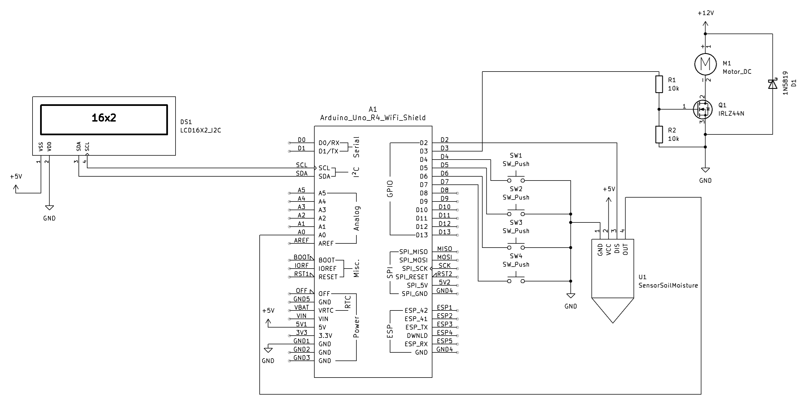

# DIY Plant Watering System

> Automated single-plant watering on Arduino UNO R4 WiFi — dry-cycle logic, incremental dosing, 14-bit ADC, EEPROM logging, and a full LCD menu with calibration wizard.

[]()
[]()
[]()
[](LICENSE)

---



---

## How It Works

**Dry cycle** — Moisture is logged every 15 minutes. Auto-watering fires only after **two consecutive readings** below the minimum threshold (default 55%), avoiding false triggers from sensor noise.

**Incremental watering** — On the first trigger, the pump delivers an initial 50 mL dose, then waits 15 minutes for capillary absorption before re-reading. If moisture is still below the target (75%), additional 10 mL increments are delivered with 1-minute soak times between each. If moisture fails to rise after pumping, the system halts to prevent flooding.

---

## Key Design Decisions

| Decision | What | Why |
|---|---|---|
| Capacitive sensor | Cytron MCP6004-based | No electrolytic corrosion; lasts 1–2+ years vs weeks for resistive |
| DIS pin control | Sensor powered via D2 | Only energized during readings; extends sensor life, reduces parasitic current |
| 14-bit ADC | `analogReadResolution(14)` | 16 384 steps vs 1 024; far better moisture resolution |
| Median sampling | 10 samples, bubble sort | Rejects outliers; more stable than averaging alone |
| Peristaltic pump | 12V S-3Z type | Safe to run dry, precise dosing, no gravity siphoning |
| MOSFET switch | IRLZ44N logic-level | Silent, fast, no coil current; flyback diode (1N5819) on pump |
| Incremental watering | 50 mL initial + 10 mL steps | Prevents overwatering; allows soil absorption between doses |
| Soak times | 15 min initial / 1 min increment | Waits for capillary propagation before re-reading moisture |
| Dry-reading debounce | 2 consecutive low readings | Avoids watering on transient sensor noise |
| EEPROM circular log | 246 entries × 4 bytes | ~2.7 days of history at 15-min intervals; survives reboots |
| Backlight auto-sleep | 1 min timeout | Reduces LCD wear; wakes on any button press |

---

## Documentation

| File | Contents |
|---|---|
| [BOM.md](BOM.md) | Parts list with Allegro.pl / Botland.pl links and cost (~500 PLN) |
| [WATERING_LOGIC.md](WATERING_LOGIC.md) | Dry-cycle and incremental watering algorithm explained |
| [MENU_DESIGN.md](MENU_DESIGN.md) | 16×2 LCD menu structure, screen layouts, EEPROM map, state machine |
| [LESSONS_DEEP_RESEARCH.md](LESSONS_DEEP_RESEARCH.md) | Research findings from 50+ community projects |
| [watering/](watering/) | Firmware (v1.1), build guide, changelog |

---

## Repository Structure

```
plant-watering-system/
├── README.md
├── BOM.md
├── WATERING_LOGIC.md
├── MENU_DESIGN.md
├── LESSONS_DEEP_RESEARCH.md
└── watering/
    ├── README.md           # Build and upload guide
    ├── build.md            # Wiring, pin assignments, MOSFET circuit
    ├── BOM_WATERING.md     # Watering-system-specific BOM
    ├── CHANGELOG.md        # Firmware version history
    └── src/
        └── plant_watering/
            └── plant_watering.ino
```

---

## License

MIT
