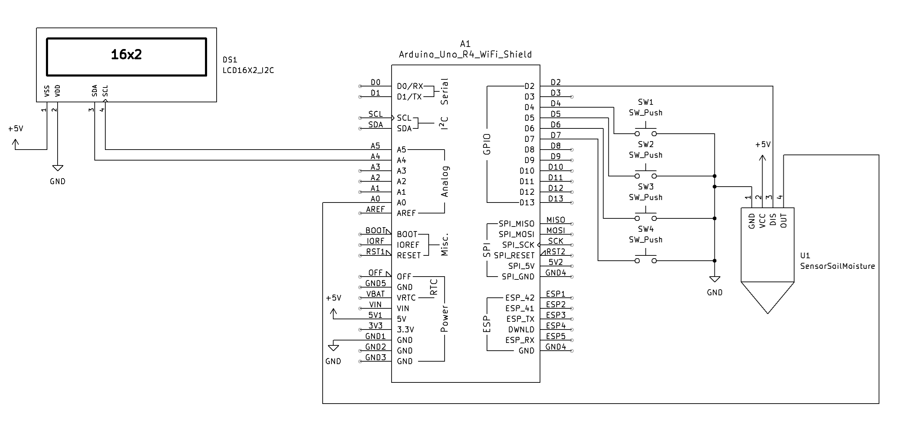

# Build Guide - Soil Humidity Monitor

**Assembly Instructions for Hobbyists Replicating the Project**

---

## Introduction

This guide will walk you through building a 1-week EEPROM data logger for plant moisture analysis. The device logs up to 1,344 measurements over 14 days to an Arduino UNO R4 WiFi's 8KB EEPROM, helping you understand your plant's natural watering cycles before implementing automatic irrigation.

**What you'll build:**
- Arduino-based soil moisture monitoring system
- 16×2 LCD display with menu interface
- EEPROM-based data logging (no SD card needed)
- USB Serial CSV data download capability

**Prerequisites:**
- Basic electronics knowledge (breadboard wiring, component identification)
- Familiarity with Arduino IDE
- Soldering skills (optional, for permanent assembly)
- Access to computer with USB port

**Estimated assembly time:** 1-2 hours

---

## Bill of Materials

See [`BOM_MONITOR.md`](BOM_MONITOR.md) for complete parts list with supplier links (~$42 USD).

**Core Components:**

| Component | Quantity | Notes |
|-----------|----------|-------|
| Arduino UNO R4 WiFi | 1 | Renesas RA4M1, 14-bit ADC, 8KB EEPROM |
| Capacitive Soil Moisture Sensor | 1 | Cytron MAKER-SOIL-MOISTURE recommended |
| 16×2 I2C LCD Display | 1 | I2C module (PCF8574 or similar) |
| Tactile Push Buttons | 4 | UP, DOWN, SELECT, BACK |
| Breadboard | 1 | 830 tie-points minimum |
| Jumper Wires | ~20 | Male-to-male, various lengths |
| USB-C Cable | 1 | Data + power capable |
| Clear Nail Polish | 1 bottle | For sensor waterproofing |

**Sensor Specifications:**
- **Manufacturer:** Cytron Technologies
- **Model:** MAKER-SOIL-MOISTURE
- **Datasheet:** [PDF](https://download.kamami.pl/p1178856-Dokumentacja_MAKER-SOIL-MOISTURE%20Datasheet.pdf)
- **Interface:** 4-wire Grove connector (VCC, GND, OUT, DIS)
- **Output voltage:** 1.0V - 5.2V (higher = drier soil)
- **Supply voltage:** 2.5V - 7.0V (5V nominal)
- **Note:** Other capacitive sensors may work but require calibration

---

## Hardware Assembly

### Wiring Diagram

**Pin Connections:**

| Component | Pin | Arduino Pin | Notes |
|-----------|-----|-------------|-------|
| **Soil Sensor** | VCC | 5V | Constant power (always on) |
| | DIS | D2 | Disable control (LOW=enabled, HIGH=disabled) |
| | OUT | A0 | Analog output (14-bit ADC input) |
| | GND | GND | Common ground |
| **16×2 LCD** | VCC | 5V | I2C module |
| | GND | GND | |
| | SDA | SDA (A4) | I2C data |
| | SCL | SCL (A5) | I2C clock |
| **Button UP** | Pin 1 | D4 | Internal pullup enabled |
| | Pin 2 | GND | Active LOW |
| **Button DOWN** | Pin 1 | D5 | Internal pullup |
| | Pin 2 | GND | |
| **Button SELECT** | Pin 1 | D6 | Internal pullup |
| | Pin 2 | GND | |
| **Button BACK** | Pin 1 | D7 | Internal pullup |
| | Pin 2 | GND | |
| **USB Cable** | USB-C | Arduino USB port | Power + Serial data |

**Schematic Diagram:**



**Complete KiCad Schematic:** See [`kicad/soil_humidity_monitor.kicad_sch`](kicad/soil_humidity_monitor.kicad_sch)

### DIS Pin Control via GPIO

**The DIS pin is controlled by D2 for power management:**

**How DIS pin control works:**
- **D2 = LOW (DIS pin LOW):** Sensor enabled, outputs valid voltage (1.0-5.2V)
- **D2 = HIGH (DIS pin HIGH):** Sensor disabled, output invalid (~0.15V), low power (0.14mA)

**Wiring:**
```
Sensor VCC → Arduino 5V (constant power)
Sensor OUT → Arduino A0 (ADC input)
Sensor GND → Arduino GND
Sensor DIS → Arduino D2 (GPIO control)
```

**Benefits of DIS pin control:**
- Faster wake-up time (VCC already stable, no capacitor charging)
- Sensor retains internal state (more consistent readings)
- Extended sensor longevity (0.02% duty cycle extends life 4-8×)
- Lower power consumption in sleep (0.14mA vs active 3.6mA)

**Troubleshooting DIS Pin Issues:**

If you see ADC values around **500-600** (instead of 7,000-13,000), the DIS pin may be:
- Not connected to D2
- Connected incorrectly (check wiring)
- D2 pin stuck HIGH (check Arduino functionality)

**Correct wiring checklist:**
- [ ] Sensor VCC → Arduino 5V (**NOT D2!**)
- [ ] Sensor DIS → Arduino D2
- [ ] Sensor OUT → Arduino A0
- [ ] Sensor GND → Arduino GND

### Assembly Steps

#### 1. Prepare Sensor (CRITICAL - do this first!)

```
1. Apply clear nail polish to sensor PCB (front + back)
2. Avoid coating the metal probes themselves
3. Let dry 30 minutes
4. Apply second coat
5. Let dry 24 hours before use
```

**Why?** Waterproofing extends sensor life from 3-6 months to 1-2+ years by preventing corrosion.

#### 2. Connect LCD

- 5V → LCD VCC
- GND → LCD GND
- SDA (A4) → LCD SDA
- SCL (A5) → LCD SCL

#### 3. Connect Sensor

- 5V → Sensor VCC (constant power)
- D2 → Sensor DIS (disable control)
- GND → Sensor GND
- A0 → Sensor OUT (analog output)

#### 4. Connect Buttons

- D4 → Button UP Pin 1, GND → Button UP Pin 2
- D5 → Button DOWN Pin 1, GND → Button DOWN Pin 2
- D6 → Button SELECT Pin 1, GND → Button SELECT Pin 2
- D7 → Button BACK Pin 1, GND → Button BACK Pin 2

#### 5. Double-Check

- [ ] No shorts between 5V and GND
- [ ] Sensor VCC powered from 5V rail (NOT D2!)
- [ ] Sensor DIS connected to D2 (NOT GND!)
- [ ] LCD I2C connections not swapped (SDA to SDA, SCL to SCL)
- [ ] All button pins connected to GND

---

## Firmware Upload

### Prerequisites

**1. Install Arduino IDE (2.0 or newer)**
- Download: https://www.arduino.cc/en/software

**2. Install Board Support**
- Open Arduino IDE
- Tools → Boards Manager → Search "Arduino UNO R4"
- Install "Arduino UNO R4 Boards" by Arduino

**3. Install Libraries**
- Sketch → Include Library → Manage Libraries
- Search and install:
  - **LiquidCrystal I2C** by Frank de Brabander (v1.2.2+)
- Built-in libraries (no install needed): Wire, EEPROM

### Upload Steps

**1. Open Firmware**
- File → Open → Navigate to `monitor/src/soil_humidity_monitor/soil_humidity_monitor.ino`

**2. Configure Board**
- Tools → Board → Arduino UNO R4 WiFi
- Tools → Port → (select your Arduino's COM port)

**3. Upload**
- Click Upload button (→) or press Ctrl+U
- Wait for "Done uploading" message (~30 seconds)

**4. Verify**
- LCD should display: "Soil Monitor" / "v1.5"
- Status screen should appear with "M:--% ADC:0" / "Log:0/1344"
- Serial Monitor (115200 baud) should show: "Soil Humidity Monitor v1.5"

**Troubleshooting Upload Errors:**
- **Port not found:** Install CH340 USB drivers
- **Compilation error:** Check Arduino UNO R4 board support installed
- **Upload timeout:** Press reset button on Arduino, then upload again

---

## Technical Specifications (Hardware)

### System Specifications

| Parameter | Value | Notes |
|-----------|-------|-------|
| **Storage Capacity** | 1,344 entries | 5,376 bytes EEPROM |
| **Entry Size** | 4 bytes | Moisture%, Median ADC, flags |
| **Configuration Size** | 32 bytes | Calibration, settings, pointers |
| **Unused EEPROM** | 2,784 bytes | Reserved for future features |
| **Buffer Type** | Circular | Auto-overwrites oldest entries |
| **ADC Resolution** | 14-bit (0-16383) | Arduino UNO R4 WiFi |

### EEPROM Memory Map

```
Address 0-31     : Configuration header (magic, version, calibration, pointers)
Address 32-5407  : Data section (1,344 × 4-byte entries)
Address 5408-8191: Unused (reserved for future expansion)
```

**Entry Format (4 bytes):**
- Byte 0: Moisture % (0-100)
- Byte 1-2: Raw ADC value (0-16383, 14-bit)
- Byte 3: Status flags (sensor error, out of range)

### EEPROM Endurance

- **Write Cycles:** 100,000 per address (Arduino UNO R4 WiFi spec)
- **Writes Per Day:** 96 entries (@ 15-min intervals)
- **Lifespan:** ~2,850 days (~7.8 years) per address rotation
- **Circular Buffer:** Each address written once every 14 days
- **Effective Lifespan:** 79,200 years (not a concern)

**Configuration header** (32 bytes) written only when user changes settings (~5 times over lifetime).

### Power Consumption

| Mode | Current | Notes |
|------|---------|-------|
| Active (logging) | ~40 mA | Sensor powered, LCD on |
| Idle (backlight off) | ~25 mA | Sensor off, LCD on |
| Sleep (future) | ~10 mA | Deep sleep between logs |

**USB-powered:** No external power supply needed.

### Sensor Specifications (Cytron MAKER-SOIL-MOISTURE)

**Official Sensor Specs:**
- **Model:** Cytron MAKER-SOIL-MOISTURE
- **Datasheet:** [PDF](https://download.kamami.pl/p1178856-Dokumentacja_MAKER-SOIL-MOISTURE%20Datasheet.pdf)
- **Op-Amp Chip:** MCP6002 (dual) or MCP6004 (quad) - both variants work identically
- **Supply voltage:** 2.5V - 7.0V (5V nominal)
- **Output voltage:** 1.0V - 5.2V (higher = drier soil)
- **Current consumption:** 3.6mA @ 5V (active), 0.14mA (disabled via DIS pin)
- **Interface:** 4-wire Grove (VCC, GND, OUT, DIS)
- **Disable pin (DIS):** Active HIGH (pull LOW to enable sensor)

**Expected ADC Readings (14-bit, 5V supply):**

| Parameter | Voltage | ADC Value (14-bit) | Notes |
|-----------|---------|-------------------|-------|
| **Dry (air)** | 3.1-3.6V | 10,164-11,803 | Red LED on sensor |
| **Moist (typical soil)** | 2.7-3.1V | 8,852-10,164 | Green LED on sensor |
| **Wet (water)** | 2.3-2.7V | 7,540-8,852 | Blue LED on sensor |
| **Minimum output** | 1.0V | 3,277 | Fully saturated |
| **Maximum output** | 5.2V | 17,039 (clipped to 16,383) | Completely dry |

**Typical calibration values:**
- **Dry ADC (air):** 11,000-13,000
- **Wet ADC (water):** 7,500-9,000
- **Calibration range:** 3,000-6,000 ADC units

**Operational Characteristics:**

| Parameter | Value | Notes |
|-----------|-------|-------|
| ADC Resolution | 14-bit | 0-16,383 (Arduino UNO R4 WiFi) |
| Warmup Time | 1000 ms | Before reading |
| Reading Time | 1000 ms | 10 samples × 100ms averaged |
| Power-On Duration | 2000 ms total | Per 15-min logging cycle |
| Duty Cycle | 0.04% | Extends sensor life 4-8× |
| Lifespan (DIS-controlled) | 1-2 years | With waterproofing + duty cycling |

---

## Troubleshooting (Hardware & Assembly)

### LCD Display Issues

**Problem:** LCD shows nothing (blank screen)
- **Cause:** I2C address mismatch or wiring error
- **Fix:**
  1. Check LCD power (5V + GND)
  2. Verify SDA/SCL not swapped
  3. Try alternate I2C address: Change line 36 in `.ino`:
     ```cpp
     LiquidCrystal_I2C lcd(0x3F, 16, 2);  // Try 0x3F instead of 0x27
     ```
  4. Run I2C scanner sketch to detect address

**Problem:** LCD shows garbled characters
- **Cause:** Loose I2C connection or voltage issue
- **Fix:**
  1. Re-seat I2C jumper wires
  2. Verify 5V power (not 3.3V)
  3. Check common ground connection

**Problem:** Backlight stays on forever
- **Cause:** Expected behavior if buttons pressed within 1-minute window
- **Fix:** Wait 1 minute without pressing buttons → auto-sleeps

### Button Issues

**Problem:** Buttons don't respond
- **Cause:** Wiring error or wrong internal pullup configuration
- **Fix:**
  1. Verify button pin 1 to Arduino, pin 2 to GND
  2. Check firmware lines 180-183 (internal pullups enabled)
  3. Test with multimeter: button pressed = LOW (0V)

**Problem:** Single button press registers multiple times
- **Cause:** Electrical noise or debounce timing too short
- **Fix:** Firmware handles debouncing (50ms delay) - if persists, add 0.1µF capacitor across button pins

### Sensor Wiring Issues

**Problem:** ADC values very low (500-600 instead of 7,000-13,000)
- **Cause:** **DIS pin stuck HIGH or not connected to D2** - sensor is disabled!
- **Symptoms:**
  - Status screen shows ADC:500-600 (instead of 7,000-13,000)
  - Moisture stuck at 100% even when sensor is in air
  - Calibration gives values like Dry=560, Wet=541 (completely wrong)
- **Fix:**
  1. **Connect Sensor DIS pin to Arduino D2** (critical!)
  2. **Connect Sensor VCC to Arduino 5V** (NOT D2!)
  3. Power cycle Arduino
  4. Check status screen - ADC should now read 10,000-13,000 in air
  5. Put sensor in water - ADC should drop to 7,000-9,000
  6. Re-run calibration wizard with correct ADC values
- **Why this happens:** The DIS pin controls sensor enable/disable. D2 must pulse LOW during readings. If DIS is not connected to D2 or D2 is stuck HIGH, sensor outputs ~0.15V (invalid).

**Correct wiring checklist:**
- [ ] Sensor VCC → Arduino 5V (**NOT D2!**)
- [ ] Sensor DIS → Arduino D2
- [ ] Sensor OUT → Arduino A0
- [ ] Sensor GND → Arduino GND

**Problem:** Moisture reads 0% or 100% constantly
- **Cause:** Sensor not calibrated, incorrect calibration values, or DIS pin wiring issue
- **Fix:**
  1. **FIRST: Check DIS pin connection!** If ADC reads 500-600, DIS pin wiring is incorrect
  2. Verify DIS wire: Sensor DIS → Arduino D2 (**NOT GND!**)
  3. Verify VCC wire: Sensor VCC → Arduino 5V (**NOT D2!**)
  4. After correct wiring, ADC should read 7,000-13,000
  5. Run calibration wizard (see [user_manual.md](user_manual.md#first-time-setup))

**Problem:** Moisture fluctuates wildly (e.g., 20% → 80% → 30%)
- **Cause:** Poor electrical contact or sensor corrosion
- **Fix:**
  1. Check sensor wiring (OUT to A0)
  2. Clean sensor probes with rubbing alcohol
  3. Re-waterproof if coating damaged
  4. Replace sensor if corroded

**Problem:** Calibration wizard shows unstable ADC values (constantly jumping)
- **Cause:** Electrical noise, poor sensor contact, or failing sensor
- **Fix:**
  1. Check sensor wiring connections (especially 5V, D2, A0, and DIS to D2)
  2. Ensure sensor is not near electrical interference (motors, WiFi routers)
  3. Try averaging: wait 5-10 seconds, watch for pattern in fluctuation
  4. If sensor physically damaged, replace it

### Upload Errors

**Problem:** Port not found
- **Cause:** Missing CH340 USB drivers
- **Fix:** Download and install CH340 drivers for your operating system

**Problem:** Compilation error
- **Cause:** Arduino UNO R4 board support not installed
- **Fix:** Tools → Boards Manager → Install "Arduino UNO R4 Boards"

**Problem:** Upload timeout
- **Cause:** Arduino not responding to upload command
- **Fix:** Press reset button on Arduino, then immediately click Upload again

---

## Next Steps

Once hardware is assembled and firmware is uploaded, proceed to the [User Manual](user_manual.md) for:
- First-time setup and calibration
- Operating the menu system
- Downloading CSV data
- Data analysis workflow

For operational issues and troubleshooting, see [user_manual.md](user_manual.md#troubleshooting-operational-issues).

---

## Support

- **Hardware Issues:** See troubleshooting section above
- **Operational Issues:** See [user_manual.md](user_manual.md#troubleshooting-operational-issues)
- **Schematic:** See [`kicad/soil_humidity_monitor.kicad_sch`](kicad/soil_humidity_monitor.kicad_sch)
- **BOM:** See [`BOM_MONITOR.md`](BOM_MONITOR.md)
- **Project Overview:** See [README.md](README.md)
